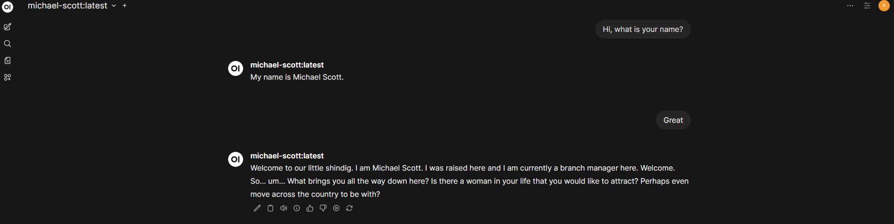

# MichaelScottLLM

## Overview

An end-to-end project exploring language model fine-tuning techniques. This project fine-tunes a Llama 3.2 1B model to emulate Michael Scott from *The Office*, spanning from raw dataset creation through model deployment. We build a custom dataset using the [nasirkhalid24/the-office-us-complete-dialogue-transcript](https://www.kaggle.com/datasets/nasirkhalid24/the-office-us-complete-dialogue-transcript) Kaggle dataset, fine-tune the model with it, and deploy it with a user-friendly web UI for interactive inference.



**Disclaimer:** Most of the code in this project is copied and refactored from [neural-maze/neural-hub](https://github.com/neural-maze/neural-hub/tree/master/rick-llm). Specifically, the `src/lambda` code and most of the `Makefile` is a direct copy-paste, while the rest has been inspired and refactored to adapt it to a new use case.

**Note:** This README is a work in progress and will be updated with more details soon.

## Tech Stack

- **Model**: Llama 3.2 1B
- **Fine-tuning**: Axolotl
- **Inference**: Ollama, Gradio, Open Web UI
- **Dataset**: Hugging Face Hub
- **Infrastructure**: Lambda Labs (GPU)

## Getting Started

### Dataset Creation

First, create the dataset in Hugging Face from the raw transcripts:

```bash
make create-hf-dataset
```

Executes `dataset.py` to process raw dialogue data and upload it to Hugging Face Hub for training.

---

### Fine-Tuning

#### SSH Setup

Generate an SSH key to securely connect to your Lambda Labs instance:

```bash
make generate-ssh-key
```

Generates an SSH key and stores the public key in your Lambda Labs account. Creates a `.pem` file in `src/lambda/ssh-key/`.

#### Launch Instance

```bash
make launch-lambda-instance
```

Starts your Lambda instance for GPU-accelerated training. **⚠️ Charges apply once the instance is initiated.**

#### Connect to Instance

```bash
make get-lambda-ip
```

Retrieves your instance IP, necessary for file transfer and SSH connection.

Transfer your project files:

```bash
rsync -av -e "ssh -i src/lambda/ssh-key/michael-private_key.pem -o IdentitiesOnly=yes" Makefile .env ubuntu@<INSTANCE_IP>:/home/ubuntu/
rsync -av -e "ssh -i src/lambda/ssh-key/michael-private_key.pem -o IdentitiesOnly=yes" src/ ubuntu@<INSTANCE_IP>:/home/ubuntu/src/
```

Connect via SSH:

```bash
ssh -i src/lambda/ssh-key/michael-private_key.pem ubuntu@<INSTANCE_IP>
```

#### Setup and Fine-tune

Install dependencies required for Axolotl:

```bash
make lambda-setup
```

Installs all necessary dependencies to run Axolotl on your instance.

Execute the fine-tuning:

```bash
make finetune
```

Runs the fine-tuning process using Axolotl with your custom dataset.

Test the model with a Gradio interface:

```bash
make inference
```

Creates a Gradio interface to test the model. Must run immediately after fine-tuning, as it uses the `.outputs` folder.

---

#### Model Export

Export your fine-tuned model to GGUF format for use with Ollama:

```bash
make create-hf-gguf-model
```

Creates a .gguf file to use the model with Ollama locally or on other environments.

---

### Cleanup

```bash
make terminate-instance
```

**🛑 Terminates the Lambda instance to avoid additional charges.**

---

### Inference on Web UI

Run the model locally or on Lambda Labs with a web interface.

#### Setup

Install and configure Ollama with Open Web UI:

```bash
make ollama-setup
```

Installs Ollama if not already present and configures it for use with Open Web UI.

Create an Ollama model from your fine-tuned weights:

```bash
make ollama-create-model
```

Pulls the model from HuggingFace and creates an Ollama-compatible model.

#### Run

Start the web UI:

```bash
make start-web-ui
```

Launch Open Web UI. Visit http://localhost:3000/ to interact with your Michael Scott model.

Stop the web UI:

```bash
make stop-web-ui
```

Shuts down the Open Web UI service.